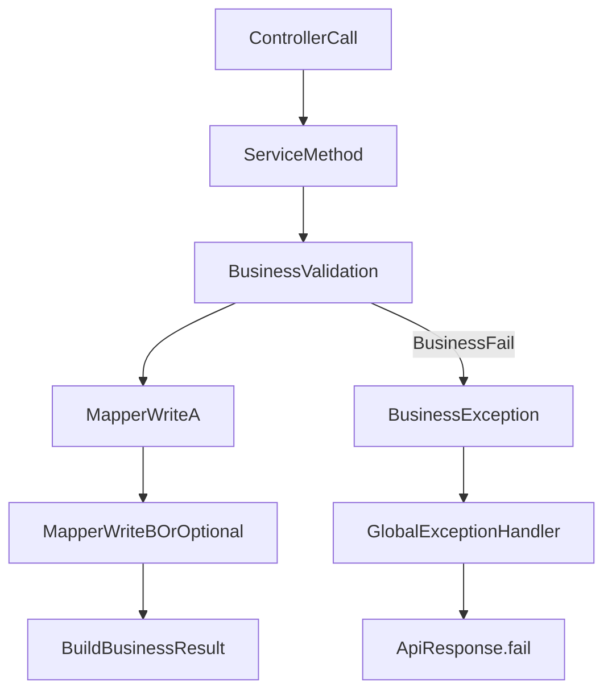

# Service编排与事务边界

## 目标
明确 Service 层在本项目中的定位：承接业务规则，而非仅做透传。

## 代码位置
- `bookshop/src/main/java/com/bookshop/service/book/impl/BookServiceImpl.java`
- `bookshop/src/main/java/com/bookshop/service/user/impl/UserServiceImpl.java`
- `bookshop/src/main/java/com/bookshop/service/login/impl/LoginServiceImpl.java`

## Service 层责任
- 聚合多步骤业务逻辑（校验、状态判断、调用 Mapper、生成返回对象）。
- 抛出 `BusinessException` 表达可预期业务失败。
- 在认证场景中协调 JWT 与 Redis（见 `LoginServiceImpl`）。

## 编排与事务边界图
阅读提示：从上到下看，主干是业务编排路径，右侧分支是业务异常进入全局处理器。

## 图解摘要
- Service 是业务编排中心，负责校验、写库、组装结果。
- 业务失败不在 Controller 内消化，而是抛 `BusinessException`。
- 异常统一交给全局处理器转换为标准失败响应。

## 对应源码入口
- `bookshop/src/main/java/com/bookshop/service/login/impl/LoginServiceImpl.java`
- `bookshop/src/main/java/com/bookshop/exception/GlobalExceptionHandler.java`

## 事务边界建议
- 当前代码以单 SQL 或小事务场景为主，复杂跨表写入再引入 `@Transactional`。
- 事务放在 Service 层，Controller 与 Mapper 不承担事务编排。

## 下一篇
阅读 `10-请求链路/04-Mapper与SQL执行路径.md`。
