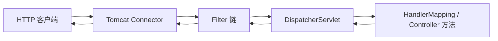

# 01-Tomcat 与请求入口

> 独立成篇，不依赖本仓库其他章。

## 1. 嵌入式 Tomcat 在做什么
- 在 Spring Boot 中引入 `spring-boot-starter-web` 时，会带上**嵌入式 Tomcat**：进程内直接起一个 Web 服务器，而不是另外安装一套 Tomcat 再部署 war。  
- Tomcat 对开发者暴露的核心抽象仍是：**先接 HTTP 连接，再按 Servlet 规范把请求交给已注册的 `Servlet`；在此之前可以经过多段 `Filter`**。

## 2. 从 TCP 到「进入 MVC」的极简路径
1. **连接与协议**：操作系统的监听端口上，Tomcat 的 Connector 收 HTTP/1.1 等报文。  
2. **封装请求/响应**：容器创建 `HttpServletRequest` / `HttpServletResponse`。  
3. **Filter 链**（若已注册）：按顺序执行，可对请求做修改、短路、增强响应。  
4. **Servlet 阶段**：对 Spring Web 应用，核心入口是 **`DispatcherServlet`（一个 Servlet）**。它不属于「业务里手写 Servlet」的常态，但机制上就是「某个 Servlet 收到请求」。  
5. **Spring MVC**：`DispatcherServlet` 内部用 `HandlerMapping` 选 Controller 方法、用 `HandlerAdapter` 调方法、用视图或消息转换器写回响应；Controller 上常见的 `@RestController` 即在这一层。  

因此：**到 MVC 为止**，可以理解为：Tomcat 调 Servlet，其中负责 MVC 分发的即 `DispatcherServlet`。

## 3. 流程示意（Mermaid）

## 4. 和「只学 Servlet」时画的图有何差别
- 老教材常画 `ServletA`、`ServletB` 多个；在 Spring Boot MVC 里，对外的业务入口**通常统一走 `DispatcherServlet`**，由它再路由到多个 `@RequestMapping` 方法。  
- 多出来的主要是：**Filter 链**（可含安全框架）、**MVC 的分发与参数绑定**，而不是在业务里再写大量 `HttpServlet#service`。

**上一篇**：[00-本章导读.md](./00-本章导读.md)  
**下一篇**：[02-JavaWeb-SpringMVC-SpringBoot关系.md](./02-JavaWeb-SpringMVC-SpringBoot关系.md)
