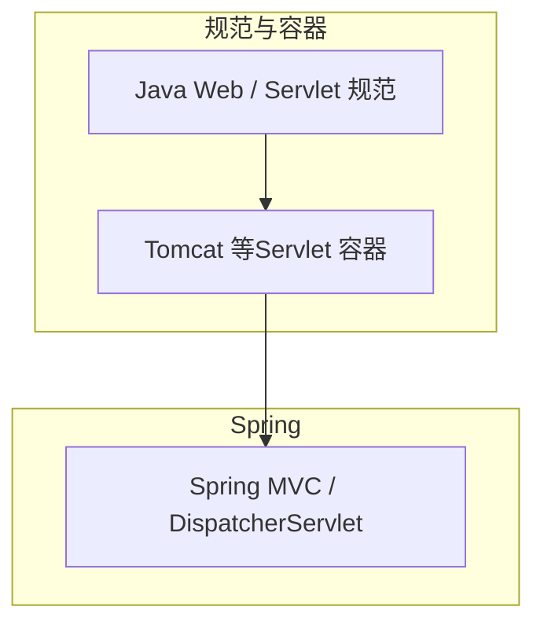
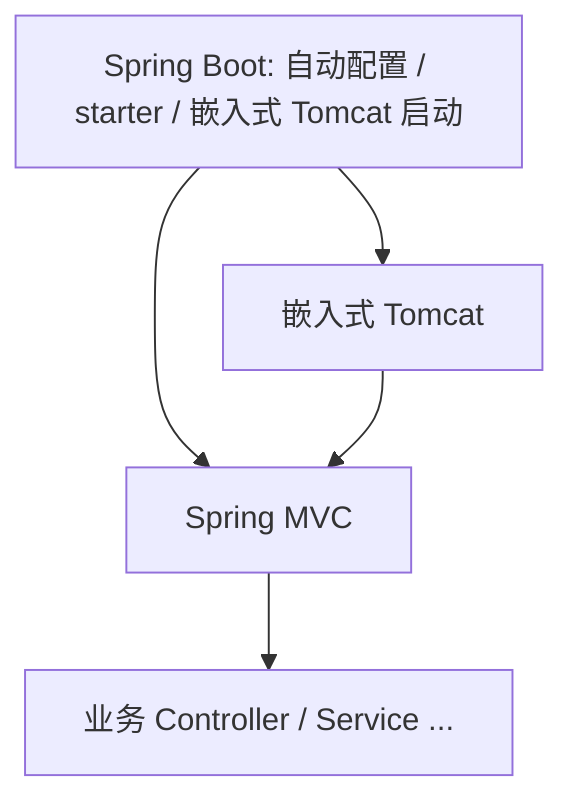

# 02-JavaWeb、Spring MVC、Spring Boot 三者的关系

> 独立成篇，不依赖本仓库其他章。用语偏概念，与具体工程目录解耦。

## 1. 各块各自解决什么
- **Java Web（Jakarta EE / 原 Java EE 的 Web 部分）**  
  约定：在应用服务器或 Servlet 容器里，用 **Servlet、Filter、Listener** 等写 Web 层；**Tomcat 等容器**实现这些规范。不绑定 Spring。  
- **Spring MVC**  
  建立在 Servlet 之上：用 **`DispatcherServlet`** 作前端控制器，把请求路由到带注解的 Controller。依赖 Servlet 与容器，与「是不是 Spring Boot」无关。  
- **Spring Boot**  
  不是「另一套 Web 标准」，而是 **Conventions + 自动配置 + 依赖管理**：把嵌入式 Tomcat、Spring MVC、常见 starter 在**可运行 main** 下组合好，省掉大量 XML/样板配置。  

可记一句话：**规范在 Servlet 层，MVC 在 Spring，Boot 在「怎么启动与装配」**。

## 2. 关系结构图（Mermaid）

### 2.1 从规范到实现（纵向）

### 2.2 Spring Boot 包在外面（工程视角）

**依赖方向（概念）**  
- 业务与 MVC 仍运行在 **Servlet 容器**里；**Boot 负责把容器与 MVC 一起带起来**。

## 3. 容易混淆的两点
- **「Spring Boot 替代了 Java Web 吗」**  
  没有。Boot 只是让你少写配置；请求仍然按 Servlet 生命周期进容器。  
- **「MVC 和 Servlet 是两层吗」**  
  `DispatcherServlet` 本身就是一个 `Servlet`；MVC 是**建立在其中一个 Servlet 上的框架层**。

**上一篇**：[01-Tomcat与请求入口.md](./01-Tomcat与请求入口.md)  
**下一篇**：[03-Filter链路与接入方式.md](./03-Filter链路与接入方式.md)
