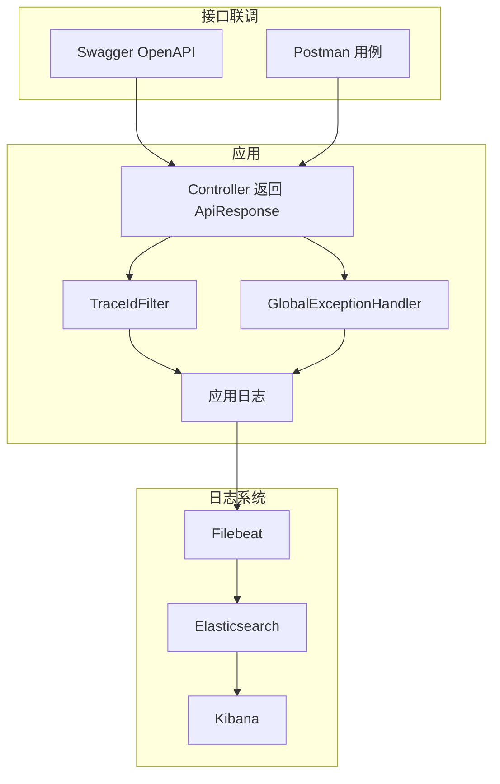

# 可观测与联调体系 · 本章导读

> 对应 `询问.md` 当前四问：ELK+Filebeat、Swagger/Postman、TraceId、异常统一处理。  
> 本章保持独立阅读，不依赖其他编号章节。

## 全章关系图

| 主题 | 阅读 |
|------|------|
| ELK 与 Filebeat 组成、作用、协作 | [01-ELK与Filebeat协作链路.md](./01-ELK与Filebeat协作链路.md) |
| Swagger 与 Postman 联调实践 | [02-Swagger与Postman联调实践.md](./02-Swagger与Postman联调实践.md) |
| 日志与 TraceId | [03-日志与TraceId链路.md](./03-日志与TraceId链路.md) |
| 异常与统一处理 | [04-异常与统一处理.md](./04-异常与统一处理.md) |

**上一篇**：[00-技术点总览.md](../00-技术点总览.md)  
**下一篇**：[01-ELK与Filebeat协作链路.md](./01-ELK与Filebeat协作链路.md)
