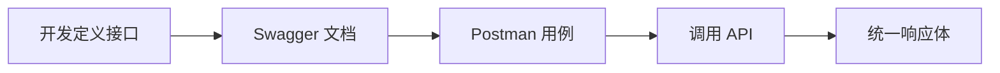

# 02-Swagger 与 Postman 联调实践

## 1. 两者分工
- `Swagger/OpenAPI`：自动生成接口说明，确认路径、请求体、响应模型。
- `Postman`：组织用例、批量执行、环境变量管理、回归验证。

## 2. 项目内可用入口
- `application.yml` 中已配置：
  - `springdoc.api-docs.path: /v3/api-docs`
  - `springdoc.swagger-ui.path: /swagger-ui.html`
- 依赖来自 `pom.xml`：`springdoc-openapi-starter-webmvc-ui`。

## 3. 联调最小流程
1. 先在 Swagger UI 确认接口契约（字段名、必填项、响应结构）。
2. 再在 Postman 建集合，区分成功、参数错误、权限错误等场景。
3. 校验响应是否遵循统一结构（`code/success/message/data`）。

**上一篇**：[01-ELK与Filebeat协作链路.md](./01-ELK与Filebeat协作链路.md)  
**下一篇**：[03-日志与TraceId链路.md](./03-日志与TraceId链路.md)
