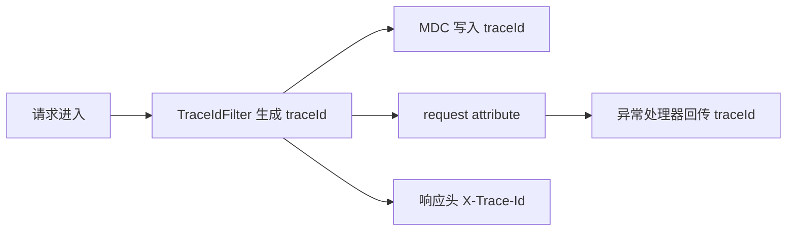

# 03-日志与 TraceId 链路

## 1. TraceId 解决什么问题
- 一个请求跨越多个层（Filter、Controller、Service）时，便于把同一次请求的日志串起来。
- 前端或调用方可通过 `X-Trace-Id` 反馈问题，后端据此快速定位日志。

## 2. 项目内实现要点
- `TraceIdFilter` 在请求进入时生成 `traceId`。
- 写入 `MDC`，并放入 request attribute。
- 同步到响应头：`X-Trace-Id`。

## 3. 排障实践
- 先拿到问题请求的 `traceId`。
- 在日志系统按 `traceId` 查询，串联该请求的全部日志。
- 若有异常响应，可直接对照全局异常处理返回体中的 `traceId` 与 `path`。

**上一篇**：[02-Swagger与Postman联调实践.md](./02-Swagger与Postman联调实践.md)  
**下一篇**：[04-异常与统一处理.md](./04-异常与统一处理.md)
