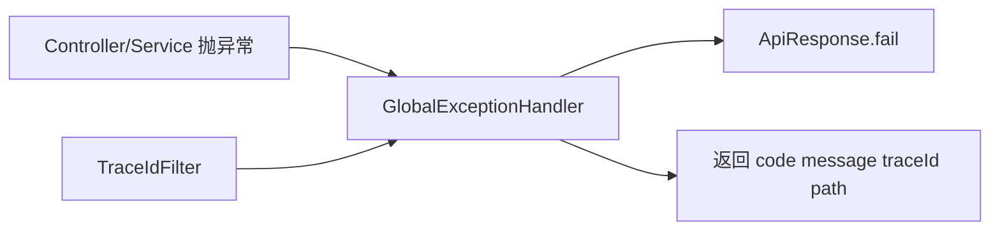

# 04-异常与统一处理（`@RestControllerAdvice`）

## 1. 为什么要统一异常
- 保证失败响应格式一致，便于前端与测试处理。
- 避免把堆栈直接暴露给客户端。
- 与 `traceId` 配合，提升排障效率。

## 2. 项目中的异常分层（示例）
- 业务异常：`BusinessException`，返回业务码与业务文案。
- 参数校验异常：`MethodArgumentNotValidException`，统一转 `VALIDATION_400`。
- 兜底异常：`Exception`，统一转 `SYSTEM_500`。

## 3. 响应结构
当前项目统一响应包含：`code`、`success`、`message`、`data`，失败场景还带 `timestamp`、`path`、`traceId`。

## 4. 处理链路图


## 5. 代码示意（取自项目结构）
```java
@RestControllerAdvice
public class GlobalExceptionHandler {
    @ExceptionHandler(BusinessException.class)
    public ApiResponse<Void> handleBusinessException(BusinessException ex, HttpServletRequest request) { ... }

    @ExceptionHandler(MethodArgumentNotValidException.class)
    public ApiResponse<Void> handleValidationException(MethodArgumentNotValidException ex, HttpServletRequest request) { ... }

    @ExceptionHandler(Exception.class)
    public ApiResponse<Void> handleException(Exception ex, HttpServletRequest request) { ... }
}
```

**上一篇**：[03-日志与TraceId链路.md](./03-日志与TraceId链路.md)  
**下一篇**：[00-技术点总览.md](../00-技术点总览.md)
