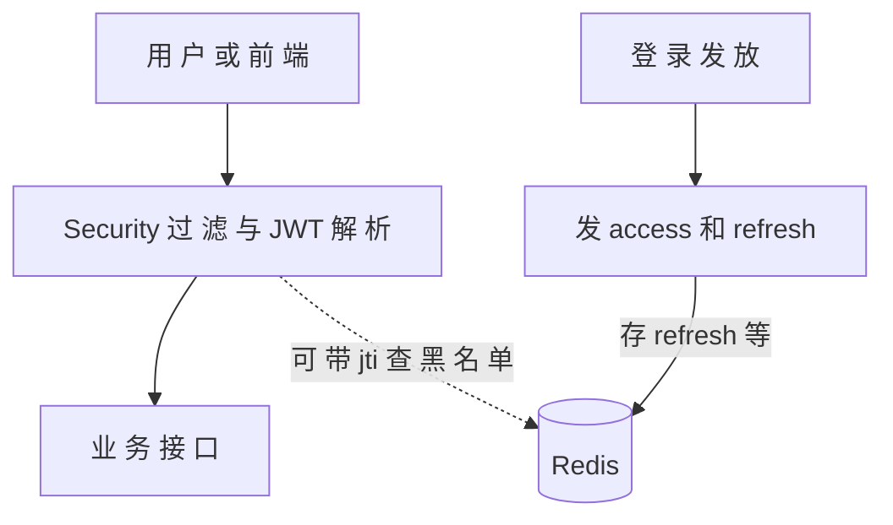

# 安全体系 · 本章导读

> 与 [询问清单.md](../询问清单.md) 中「安全体系」四问一一对应；**只读本 `110-…/安全体系` 与总清单**，不读仓库中其他编号章亦可。篇内附 **Mermaid 结构图**。

## 全图：Spring Security、JWT、Redis 怎么叠在一起
典型「无状态登录 + 可吊销」形态：请求先过 **Security 链** 与 **JWT 过滤**；**access** 随 **Authorization** 走；**refresh** 与 **黑名单/设备** 常落 **Redis**（键带用户名、设备或 `jti`）。

| 问题 | 阅读 |
|------|------|
| Spring Security 起什么作用、链上在哪 | [01-Spring-Security-链与无状态.md](./01-Spring-Security-链与无状态.md) |
| JWT 由哪些部分组成、怎么解析、access 与 refresh | [02-JWT-结构-解析与双令牌.md](./02-JWT-结构-解析与双令牌.md) |
| Redis 里键怎么设计（refresh、黑名单等） | [03-Redis-键与典型用途.md](./03-Redis-键与典型用途.md) |
| 结构图 | 本篇上图 + 各篇内置分图 |

**上一篇**：[00-技术点总览.md](../00-技术点总览.md)  
**下一篇**：[01-Spring-Security-链与无状态.md](./01-Spring-Security-链与无状态.md)
