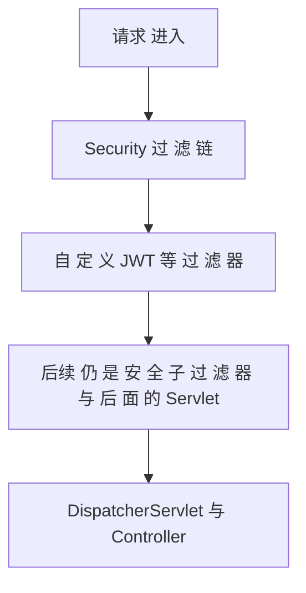

# 01-Spring Security：链、白名单、无会话

> 独立成篇；不依赖本仓库 30- 等章。下图为**概念**层的 Security 与自定义 JWT Filter 的叠放关系。

## 1. 解决什么问题
- **统一**「哪些 URL 要登录、哪些放行」「未登录/无权限时返回 401/403」。  
- 在 Servlet 上表现为一条 **Filter 链**；Spring Security 用 **`SecurityFilterChain` Bean** 配置这一条链。  
- 与「表单登录、Session」相比，**前后端分离 + JWT** 时常配 **`SessionCreationPolicy.STATELESS`**，不在服务端保存会话，靠 **每请求带 `Authorization: Bearer ...`** 识别身份。

## 2. 结构图：链与自定义过滤器插在哪

- **白名单**（permitAll）：如登录、健康检查、部分注册接口、文档路径等，不强制带 token。  
- **自定义 JWT Filter** 常 **`addFilterBefore` 到 `UsernamePasswordAuthenticationFilter` 前**：在到达业务 Controller 前，已把**合法 access** 解出来并写入 `SecurityContext`；非法则**交给**已配置的 401/403 处理器。

## 3. 三个常见概念（和 JWT 联用时）
- **无会话（stateless）**：不依赖 `JSESSIONID`，避免集群 sticky；代价是**吊销 access** 要另想办法（如短 TTL、黑名单、改密码后失效，见同目录 03）。  
- **EntryPoint / AccessDeniedHandler**：未认证与已认证但无权限时，**统一 JSON 错误体**，便于前后端联调。  
- **UserDetailsService**：走「用户名密码表单」时常用；**纯 JWT 状态less 模式** 下，有时返回「未用」的桩实现，**实际身份**从 token 来。

**上一篇**：[00-本章导读.md](./00-本章导读.md)  
**下一篇**：[02-JWT-结构-解析与双令牌.md](./02-JWT-结构-解析与双令牌.md)
