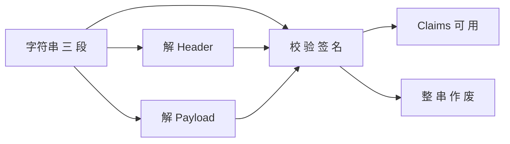

# 02-JWT：结构、签名、解析与双令牌

> 独立成篇。实现库若用 JJWT、Nimbus 等，API 名会变，**分段与校验逻辑**相同。

## 1. 一串 JWT 长什么样（JWS 常见形态）
- 由 **三段** 用点号拼接：**Header** · **Payload** · **Signature**（Base64URL 编码，不是可读的 JSON 原样，需解码后看）。  
- **Header**：常见 `{"alg":"HS256","typ":"JWT"}`，声明签名算法。  
- **Payload**：**Claims**（**注册声明** 如 `exp`/`iat`/`sub`；**自定义** 如 `type=access/refresh`、`deviceId` 等）。  
- **Signature**：用**密钥**对前两段做 HMAC 或 RSA 等，**防篡改**；改 payload 不重新签名则**校验失败**。

## 2. 解析时在做什么
1. **Base64 解码** Header/Payload，读算法与声明。  
2. 用**同一密钥/公钥**对签名做**验证**（对称 HS256 或 非对称 RS256 等）。  
3. 检查 **`exp` 未过期**；按需检查 **`sub`、自定义 `type`** 是否为 access 等。  
4. 验证通过后，把 `Claims` 当成**只读**上下文（用户名、设备、令牌类型等）。  

## 3. access 与 refresh 为什么要两个
- **access**：**短**有效期，每次受保护 API 在 `Authorization` 里带，泄露窗口相对可控。  
- **refresh**：**长**有效期，**只用于**换取新 access，**不宜**高频出现在每个资源请求上；**服务端常配合 Redis 存**「当前该用户该设备下合法的 refresh 串」，**刷新**时比对、旋转或续期（见 03）。  

在 Payload 中常用**自定义 `type` claim** 区分 access / refresh，避免**用错**令牌类型去调错接口。

## 4. 和 Spring Security 的衔接（一句话）
- **业务层** 负责签发/刷新 token；**Filter** 在请求进入时 **parse + verify** access，成功则**认证态**进 `SecurityContext`，再进 Controller。  

**上一篇**：[01-Spring-Security-链与无状态.md](./01-Spring-Security-链与无状态.md)  
**下一篇**：[03-Redis-键与典型用途.md](./03-Redis-键与典型用途.md)
