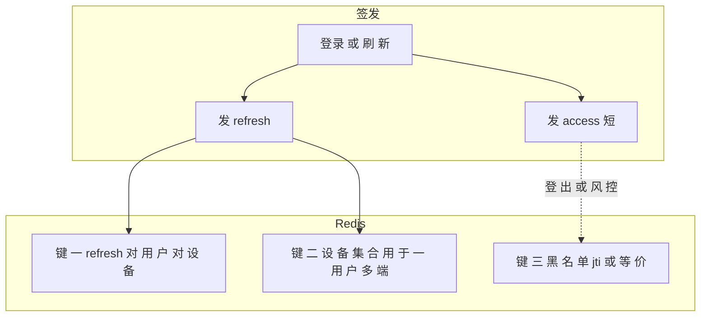

# 03-Redis：键与典型用途（refresh、黑名单、改密）

> 独立成篇。这里讲**可落地的键设计思路**；**具体前缀以你工程为准**；下列示例为**一种常见、与双令牌能对上** 的排布。

## 1. 为什么安全体系要 Redis
- **JWT 本身无状态**：不登服务端也能验证签名，但**不能天然「立刻吊销」**某次登录发出去的 access。  
- **Redis** 提供**带 TTL 的键值**与集合：适合**记住「当前有效 refresh」**、**access 的 jti 黑名单**、**改密时间戳** 等，与 JWT 短/长命周期配合。

## 2. 结构图：Redis 在 refresh 与 黑名单 里站哪

## 3. 键值设计（示例模式，可照你系统改名）
| 模式 | 含义 | 值 / 结构 | TTL |
|------|------|------------|-----|
| `auth:refresh:{username}:{deviceId}` | 该用户该**设备**下当前 refresh 串 | 字符串=完整 refresh | 与 refresh 策略一致 |
| `auth:refresh:devices:{username}` | 该用户**有哪些 deviceId 仍在线** | Set of deviceId | 可选或随设备踢下线维护 |
| `auth:blacklist:{jti}` | access 已吊销**某 jti** | `"1"` 等占位 | 到该 access 原剩余寿命即可 |
| `auth:pwd-changed:{username}` | 改密**时间**（秒） | 时间戳串 | 可长期，逻辑上配合「签发时间早于改密则拒绝」 |

**设计要点**  
- **设备维度**：`username + deviceId` 能支持「同一账号多端登录、按端下线」。键形如 **`前缀 + username + 分隔 + deviceId`** 即可。  
- **黑名单**：用 JWT **jti**（`id` claim）时，**键短、值小**，只存「是否拉黑」到该 token 原 `exp` 前即可。  
- **与解析顺序**：先验签、再查黑名单、再查改密时间（若用），**减少无效 DB 查**。

**上一篇**：[02-JWT-结构-解析与双令牌.md](./02-JWT-结构-解析与双令牌.md)  
**下一篇**：[00-技术点总览.md](../00-技术点总览.md)
