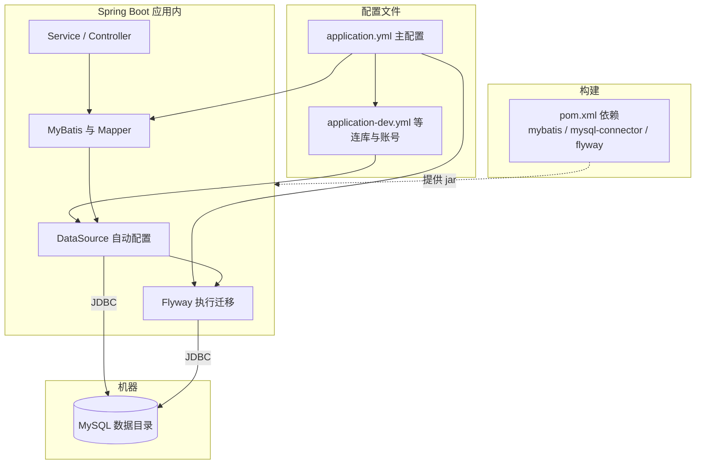

# 数据库体系 · 本章导读

> 与 [询问清单.md](../询问清单.md) 中「数据库体系」三问一一对应；**只使用本 `110-…/数据库体系` 下正文**，不读仓库中其他章亦可。

## 全章关系（一图）
阅读下面任一篇时，可对照本图，分清「**配置（YAML）**、**pom 依赖、连库、迁表、成对映射、跑 SQL**」各落在哪一层。

| 问题 | 阅读 |
|------|------|
| MyBatis 用法、请求到 SQL 链路、与 MySQL 配合 | [01-MyBatis与请求到SQL链路.md](./01-MyBatis与请求到SQL链路.md) |
| MySQL 存什么、**本机安装后 YAML 怎么配、怎么接到工程里** | [02-MySQL与项目集成简说.md](./02-MySQL与项目集成简说.md) |
| Flyway 简介与实际应用 | [03-Flyway简介与应用.md](./03-Flyway简介与应用.md) |
| **Maven 与 MySQL 相关依赖、表 / Entity / Mapper 如何配对、示例** | [04-Maven依赖与表实体Mapper配对.md](./04-Maven依赖与表实体Mapper配对.md) |

**上一篇**：[00-技术点总览.md](../00-技术点总览.md)  
**下一篇**：[01-MyBatis与请求到SQL链路.md](./01-MyBatis与请求到SQL链路.md)
