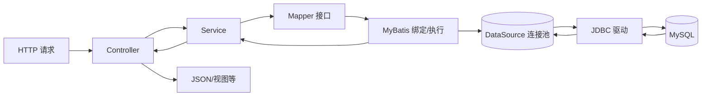
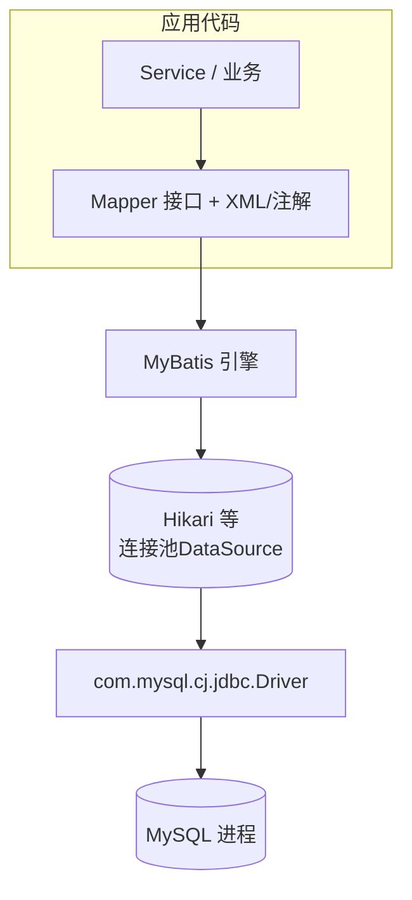

# 01-MyBatis 与「请求到 SQL」链路

> 独立成篇；用语适用于典型 Spring Boot + `mybatis-spring-boot-starter` 项目。

## 0. 结构图：请求如何落到 MySQL
下面两条线：一条是**读配置建连接池**（在 [02-MySQL与项目集成简说.md](./02-MySQL与项目集成简说.md) 展开），一条是**一次业务调用如何走到 SQL**。

### 0.1 一次 HTTP 到 SQL 的纵链路


### 0.2 MyBatis 在分层里的位置（与 JDBC、库的关系）


**下一节起**按点说明 Mapper 写法与 DML/DDL 分工。  
**表 ↔ Entity ↔ Mapper 成对、与 pom 中依赖的对应**见同目录 [04-Maven依赖与表实体Mapper配对.md](./04-Maven依赖与表实体Mapper配对.md)。

## 1. MyBatis 在工程里长什么样
- **Mapper 接口**：Java 里定义接口方法，用 `@Mapper` 或 `@MapperScan` 让 Spring 注册为 Bean。  
- **SQL 的落点**：同名的 XML（`namespace` 指向接口全名），或在接口上用 `@Select` / `@Insert` 等注解直接写短 SQL。  
- **入参与结果**：方法参数可映射为 SQL 中 `#{}` 占位符；列名与 Java 属性常通过**下划线转驼峰**等配置对齐。

简化示例（说明形态即可）：

```java
@Mapper
public interface BookMapper {
    Book selectById(@Param("id") Long id);
    int insert(Book book);
}
```

```xml
<!-- 示意：实际路径依项目习惯放在 resources 下某包 -->
<mapper namespace="com.example.bookshop.mapper.BookMapper">
  <select id="selectById" resultType="com.example.bookshop.entity.Book">
    SELECT id, title, author_id FROM book WHERE id = #{id}
  </select>
</mapper>
```

## 2. 从一次 HTTP 请求到执行 SQL 的链（概念）
1. 客户端发起请求，经 Web 层到达某个 **Service**（或等价的应用服务）。  
2. Service 调用 **Mapper 接口** 的方法。  
3. **MyBatis** 在运行时生成该接口的代理实现，根据方法名与参数绑定到对应语句。  
4. 通过 **JDBC 数据源** 向 **MySQL** 发送已解析好的 SQL 与参数。  
5. 结果集按映射规则转为 Java 对象（或基本类型）返回。  
6. 业务层把结果再组装成**响应**返回给调用方。  

可记为：**Controller（若有） → Service → Mapper → JDBC → MySQL**。

> **JDBC 连接从哪来**：不是 MyBatis 自己写死，而是 Spring Boot 根据 **`spring.datasource.*`**（通常写在 `application-*.yml`）**创建 `DataSource` Bean**；见 [02-MySQL与项目集成简说.md](./02-MySQL与项目集成简说.md) 第三节、第四节。

## 3. 与 MySQL 的「协作」指什么
- **MySQL** 是实际存表、存行、做事务的引擎。  
- **MyBatis 不负责**建表、版本迁移，那是 **DDL 与迁移工具**（如本清单中的 Flyway）常见职责。  
- **MyBatis 负责**在**已有表**之上做 DML 映射与结果映射。  

**上一篇**：[00-本章导读.md](./00-本章导读.md)  
**下一篇**：[02-MySQL与项目集成简说.md](./02-MySQL与项目集成简说.md)
