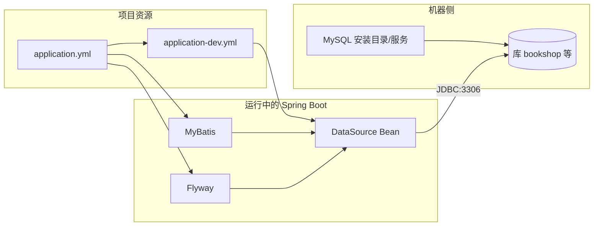

# 02-MySQL 与项目集成简说

> 独立成篇。下列把「**本机装好 MySQL → 配 YAML → 与 Spring Boot / MyBatis / Flyway 接起来**」串成一条线；示例键名与 Spring Boot 通用习惯一致，并给出一套**可对照真实工程**的写法（见各节代码块）。

## 0. 结构图：MySQL 与工程各块怎么接
MySQL 在进程外独立运行；应用**只通过 JDBC URL + 账号**连上它。配置进工程的方式在 Spring Boot 里**几乎总是** `application.yml` / `application-*.yml`（或 `.properties`）。



**为何 YAML（或 properties）是「集成」的关键一步**：`spring-boot-starter-jdbc` / MyBatis 等**不会**猜你的库 IP、库名、账号；只有读了 **`spring.datasource.*`** 后，**自动配置**才能创建**连接池**（如 HikariCP）并注入给 MyBatis 与 Flyway。不配或配错，启动阶段就会报**无法创建 DataSource** 或**连库失败**。

## 1. MySQL 里一般「存什么」
- 业务**持久化**数据，以**库 → 表 → 行**组织；**表结构**多由 [03-Flyway简介与应用.md](./03-Flyway简介与应用.md) 中的迁移脚本落库。  
- MyBatis 在表已存在后做 **DML 映射**。

## 2. 本机安装 MySQL 之后，还要在库侧做几步
1. **启动服务**（Windows 服务、或 `mysqld`、或安装包自带控制台），确保**监听端口**（默认 **3306**）可用。  
2. **建库**（与 JDBC URL 里的库名一致），例如建 `bookshop`：在客户端执行 `CREATE DATABASE bookshop ...`（字符集常选 `utf8mb4` 等，按你们规范来）。  
3. **用户与权限**：开发环境常用一个账号能连本机该库；生产会拆账号、收权限。  
4. 以上与 Java 项目**无魔法绑定**——**YAML 里写的 URL/库名/用户/密码必须与此处真实状态一致**。

到这一步，MySQL 已就绪，但**应用仍不知道怎样连接**，所以要进入下一节写配置。

## 3. 在 YAML 里配置并接入 Spring Boot（核心）

### 3.1 多文件分工（主配置 + 分环境覆盖）
- **`application.yml`**：放**与应用名、激活哪个 profile、Flyway 开关、MyBatis 行为**等**与「连哪台 MySQL 弱相关」的项。  
- **`application-dev.yml`**（当 `spring.profiles.active=dev` 时合并进来）：放**本机/开发机**的 **`spring.datasource.*`**，避免把**机器相关**的 URL、密码和别的环境搅在一起。  

**本仓库中主配置思路示例**（ Flyway 与 MyBatis 在「主 yml」里，默认激活 `dev`）：

```yaml
spring:
  application:
    name: bookshop
  profiles:
    active: dev
  flyway:
    enabled: true
    locations: classpath:db/migration
    baseline-on-migrate: true

mybatis:
  configuration:
    map-underscore-to-camel-case: true
    log-impl: org.apache.ibatis.logging.stdout.StdOutImpl
```

**开发环境连库**（`application-dev.yml` 一类，只示意「接库四要素 + 驱动」；密码请按你本机改）：

```yaml
spring:
  datasource:
    url: jdbc:mysql://127.0.0.1:3306/bookshop?useUnicode=true&characterEncoding=utf8&serverTimezone=Asia/Shanghai&useSSL=false&allowPublicKeyRetrieval=true
    username: root
    password: 你的本地密码
    driver-class-name: com.mysql.cj.jdbc.Driver
```

- **`url`**：协议 `jdbc:mysql`、**主机/端口/库名**、以及时区、是否 SSL 等**查询参数**（缺省/错误常导致**乱码、时区差 8 小时、SSL 握手失败** 等经典问题）。  
- **`username` / `password`**：与 MySQL 里账号一致。  
- **`driver-class-name`**：与 `pom` 中引入的 `mysql-connector-j` 对应。  

> **生产/提交代码**：敏感信息应用**环境变量**或配置中心，避免明文密码进仓库。此处仅说明「集成时 YAML 要体现什么」。

### 3.2 依赖上还要有 JDBC 驱动（与 YAML 成对出现）
- `pom.xml` 中需有 `mysql-connector-j`（常由 `spring-boot-starter-jdbc` 或你项目显式声明带入）。**仅有 YAML 无驱动**会在运行时类加载阶段失败。  
- Flyway 连 MySQL 时通常还有 **`flyway-mysql`** 等模块，与 [03-Flyway简介与应用.md](./03-Flyway简介与应用.md) 一起理解。  
- **MyBatis 的 starter、Flyway 各模块、Lombok 等与「表/Entity/Mapper 怎么配对」** 的**清单表与表结构 ↔ Java 类示例**见 [04-Maven依赖与表实体Mapper配对.md](./04-Maven依赖与表实体Mapper配对.md)（**避免只配 YAML 却漏掉 pom 或列名与属性不一致**）。

## 4. 从「YAML + 本机库」到真正跑通一条线（怎么算集成成功）
1. 本机 **MySQL 已起**，且 **库名**、**账号** 与 `spring.datasource` 一致。  
2. 启动应用：Spring 读取 yml → **创建 DataSource**；若启用了 Flyway，**先执行** `classpath:db/migration` 下脚本，**建/改表**。  
3. MyBatis 使用**同一** DataSource，Mapper 执行 SQL 时**连上同一库**。  
4. 调一次会查库的业务接口，**无**连接超时/认证失败/Unknown database，且数据符合预期。  

## 5. 和「只改 yaml、库没建」类问题的区别
- **能连上**= 网、端口、用户、**库名已存在** 都对。  
- **能跑通业务**= 上一条 + **表结构已由 Flyway/手工**就绪 + 实体与表字段**一致**。

**上一篇**：[01-MyBatis与请求到SQL链路.md](./01-MyBatis与请求到SQL链路.md)  
**下一篇**：[03-Flyway简介与应用.md](./03-Flyway简介与应用.md)
