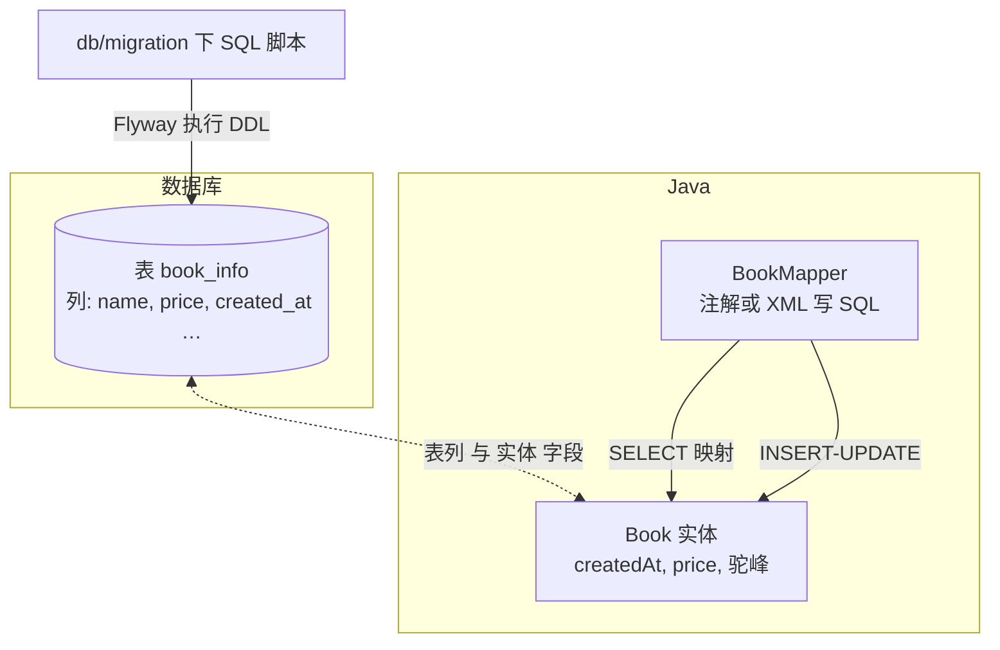

# 04-Maven 依赖与「表 — Entity — Mapper」配对

> 独立成篇。下面用本仓库**同一组**表 / 类作为示例，把 **pom 里要有什么**、**表列与 Java 怎么对齐**、**Mapper 怎么写** 收在一处。顺序建议：**表结构（含 Flyway）→ Entity 字段名 → `mybatis` 下划线转驼峰 → Mapper SQL 与 `#{}` 属性名一致**。

## 1. 与 MySQL 相关的 Maven 依赖（在做什么）
除了「连库用 YAML」之外，**编译与运行**还需要以下依赖在 `pom.xml` 中声明（版本由 `spring-boot-starter-parent` 或显式 `version` 管）：

| 依赖 | 作用（一句话） |
|------|----------------|
| `mybatis-spring-boot-starter` | 集成 Spring Boot 与 MyBatis，自动配 `SqlSessionFactory` 等。 |
| `mysql-connector-j`（`runtime`） | **JDBC 驱动**，`driver-class-name: com.mysql.cj.jdbc.Driver` 对应它。 |
| `flyway-core` + `flyway-mysql` | 迁移引擎 + MySQL 方言支持，**建/改表**与 MyBatis **用表** 衔接。 |
| `lombok`（常见为可选） | 生成 getter/setter，**不参与**与数据库列的「配对」逻辑，但实体类会常用 `@Data` 等。 |

**与 YAML 的对应关系**：  
- **YAML** 告诉 Spring **连哪台库、用什么账号、MyBatis 全局开关**；  
- **Maven** 告诉 JVM **类路径上有没有** MyBatis、MySQL 驱动、Flyway 实现；  
**缺 jar** 时现象多为 `ClassNotFoundException` / 无法创建 Bean；**缺 yml 配置** 时多为 `DataSource` 无法装配 —— 两边都要齐。

**摘自工程（节选、仅作形态示例）：**

```xml
<dependency>
  <groupId>org.mybatis.spring.boot</groupId>
  <artifactId>mybatis-spring-boot-starter</artifactId>
  <version>3.0.5</version>
</dependency>
<dependency>
  <groupId>com.mysql</groupId>
  <artifactId>mysql-connector-j</artifactId>
  <scope>runtime</scope>
</dependency>
<dependency>
  <groupId>org.flywaydb</groupId>
  <artifactId>flyway-core</artifactId>
</dependency>
<dependency>
  <groupId>org.flywaydb</groupId>
  <artifactId>flyway-mysql</artifactId>
</dependency>
```

## 2. 结构图：表、Entity、Mapper 的对应关系


（说明：Mermaid 在节点里换行用 `<br>` 比 `\n` 更稳；`#{}` 等符号不要写在**边**标签里，否则易解析失败；含义见下「`#{ }` 与属性名」一条。）

**成对关系（记忆要点）**  
- **一表一 Entity（常见）**：Entity 的**可持久化**字段，应与业务表**列语义**一一对应；**不是**一个 Entity 里混多张无关表。  
- **一表一 Mapper（常见）**：`BookMapper` 只操作 `book_info`，方法名与 SQL 对应。  
- **列名 `snake_case` ↔ 属性名 `camelCase`**：在 `mybatis.configuration.map-underscore-to-camel-case: true` 时，**SELECT 查出来的列** `created_at` 可映射到 `createdAt`；若 `SELECT` 里用了**别名**（如 `AS createdAt`），则按别名列名映射。  
- **写 SQL 时**：`INSERT/UPDATE` 的 `#{name}` 对应 Entity 的 **getter/字段名** `name`；`WHERE id = #{id}` 对应参数字段 `id`（或方法参数名）。

## 3. 示例一：表结构（由 Flyway 落库，列名是真相来源之一）
`book_info` 表（节选，与 `V1__create_book_info.sql` 一致）：

```sql
`name` VARCHAR(128) NOT NULL,
`price` DECIMAL(10,2) NOT NULL,
`created_at` DATETIME NOT NULL,
`updated_at` DATETIME NOT NULL
```

## 4. 示例二：Entity（与列语义成对，驼峰对下划线由全局配置接）
`com.bookshop.entity.book.Book` 形态：

```java
public class Book {
    private Long id;
    private String name;
    private String author;
    private java.math.BigDecimal price;
    private Integer stock;
    private java.time.LocalDateTime createdAt;  // 对应 created_at
    private java.time.LocalDateTime updatedAt;  // 对应 updated_at
}
```

- 类型上：**`DECIMAL` ↔ `BigDecimal`，`DATETIME` ↔ `LocalDateTime`** 是常见、稳妥的搭配。  
- 若**不加**下划线转驼峰，又不在 SQL 里写 `AS created_at createdAt` 等别名，则容易出现**整列对不上、映射为 null**。

## 5. 示例三：Mapper 与 Entity、表的「成对」写法
`BookMapper` 使用**注解 SQL**（同功能也可写 XML，namespace 对接口全名）：

- `SELECT` 的列名**显式写出**，与表一致；若开启驼峰映射，结果会灌进 `Book` 对应属性。  
- `@Insert` 里 `#{name}` 来自参数 `Book book` 的**属性** `name`；`@Options(useGeneratedKeys = true, keyProperty = "id")` 把自增主键**写回**实体的 `id` 属性。

```java
@Mapper
public interface BookMapper {

    @Select("SELECT id, name, author, price, stock, created_at, updated_at FROM book_info WHERE id = #{id}")
    Book selectById(Long id);

    @Insert("""
            INSERT INTO book_info(name, author, price, stock, created_at, updated_at)
            VALUES(#{name}, #{author}, #{price}, #{stock}, NOW(), NOW())
            """)
    @Options(useGeneratedKeys = true, keyProperty = "id")
    int insert(Book book);
}
```

**自检清单（避免遗漏）**  
- [ ] 表里**有**的列，INSERT/UPDATE 若需要，是否**都有** `#{...}` 或合理默认值。  
- [ ] Entity 的**属性名**与 `#{ }` **拼写**一致。  
- [ ] 查询返回多列时，**列名或别名**能否映射到 Entity 字段。  
- [ ] 改表列（Flyway 新版本）后，**Entity 与 Mapper** 是否同步改。

**上一篇**：[03-Flyway简介与应用.md](./03-Flyway简介与应用.md)  
**下一篇**：[00-技术点总览.md](../00-技术点总览.md)
