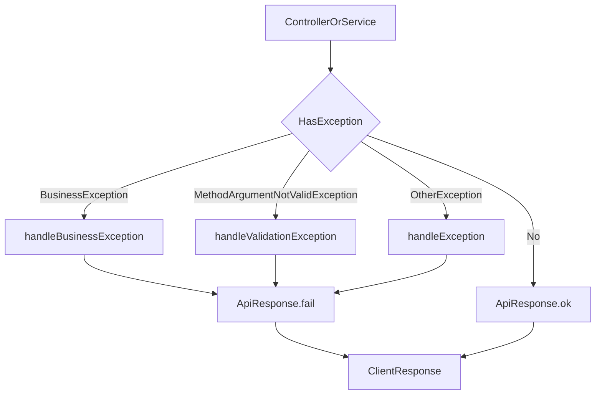

# 全局异常处理器实战说明

## 目标
说明全局异常如何被收口并输出统一响应结构。

## 代码位置
- `bookshop/src/main/java/com/bookshop/exception/GlobalExceptionHandler.java`
- `bookshop/src/main/java/com/bookshop/common/response/ApiResponse.java`

## 已实现处理器
- `handleBusinessException`：返回业务错误码和原始业务提示。
- `handleValidationException`：返回 `VALIDATION_400` 与首个字段错误。
- `handleException`：返回 `SYSTEM_500`，避免堆栈信息外泄。

## 异常流转图
阅读提示：先看 `HasException` 分支，再看三类异常如何统一收敛到 `ApiResponse.fail`。

## 图解摘要
- 正常路径直接返回 `ApiResponse.ok`，异常路径统一进入收口分支。
- 业务异常、参数异常、系统异常分别映射到固定处理方法。
- 无论异常来源如何，客户端都拿到一致的失败响应结构。

## 对应源码入口
- `bookshop/src/main/java/com/bookshop/exception/GlobalExceptionHandler.java`
- `bookshop/src/main/java/com/bookshop/common/response/ApiResponse.java`

## 响应增强字段
- `timestamp`：异常发生时间。
- `path`：请求路径，便于定位接口。
- `traceId`：链路追踪 ID，用于日志检索。

## 实战建议
- 新增异常类型时优先在这里集中映射，不在各 Controller 重复 `try/catch`。

## 下一篇
阅读 `20-异常与错误码/03-错误码体系与模块约定.md`。
