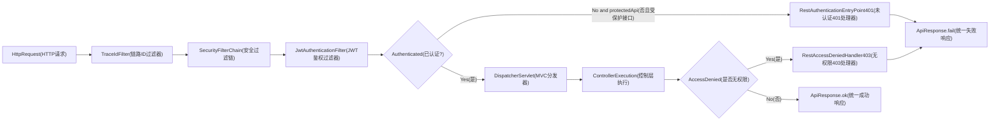

# Security体系
## 简介：
Security 是 Java Web的 **“拦路检查”** 的保安体系。它决定了“这个请求能不能进 Controller”
**核心职责**：

1. **认证**：你是谁？（通过 `JwtAuthenticationFilter` 检查 Token）
    
2. **授权**：你有没有资格干这件事？（通过 `SecurityConfig` 里的路径规则）

##  在项目里的具体表现

根据笔记里的两个关键类：

|类|作用|具体行为|
|---|---|---|
|**`SecurityConfig.java`**|制定**安保条例**|• 哪些路径不需要登录（`/login`、`/register` 白名单）   • 哪些请求必须有特定权限   • 设为 **`STATELESS`**（无状态，不存 Session）|
|**`JwtAuthenticationFilter.java`**|执行**身份证查验**|• 从请求头 `Authorization` 里扣出 Token   • 校验 Token 是否有效、是否在黑名单   • 通过后把用户信息塞进 `SecurityContext`|

**简单比喻**：

- 你走进大楼，`TraceIdFilter` 给你贴了个**编号标签**。
    
- **Spring Security** 拦下你，先看你是不是走**员工通道**（白名单），不是的话请出示**工牌**（Token），验证通过后才放你进办公区。
    

---

##  为什么是无状态（STATELESS）？

你笔记里特别强调了 `SessionCreationPolicy.STATELESS`。

- **传统有状态**：登录后服务器内存里存一个 `JSESSIONID`，下次来要对暗号。服务器压力大，扩展难。
    
- **你的项目（无状态）**：服务器**不记任何人**。每次请求都必须**重新出示 Token**。Token 里自带了用户信息，服务器只负责用密码学验证它没被篡改。
    

**好处**：加 10 台服务器，Token 照样通用，不用做 Session 共享。

---

##  Security 异常处理器的价值

你笔记里提到 _“未登录/无权限由 Security 异常处理器直接返回 JSON”_。

这意味着 **请求根本到不了 Controller**。

- **未带 Token** → Security 直接拦截，返回 `{"code":401, "msg":"未登录"}`。
    
- **Token 过期** → Security 直接拦截，返回 `{"code":401, "msg":"登录已失效"}`。
    

**好处**：Controller 里的业务代码可以**安全地假设**当前用户一定是登录过的、有权限的，不用在每个方法开头写 `if(user==null)`。

---

## 和 Java Web 的关系

`JwtAuthenticationFilter` 本质上是一个 **`javax.servlet.Filter`**（和你刚才学的 `TraceIdFilter` 是同一类接口）。

Spring Security 只是帮你**管理了这些 Filter 的排列顺序和执行条件**，底层依然是 Servlet 规范在跑。

# Security过滤器链总览

## 目标
建立 Spring Security 在本项目中的最小心智模型。

## 代码位置
- `com/bookshop/config/security/SecurityConfig.java`
- `config/security/JwtAuthenticationFilter.java`
- `config/security/RestAuthenticationEntryPoint.java`
- `config/security/RestAccessDeniedHandler.java`

## 配置要点
- 禁用：`csrf/httpBasic/formLogin`。
- 会话策略：`STATELESS`（JWT 无状态）。
- 白名单接口：`/health`、登录/刷新/验证码相关接口、`POST /api/users`。
- 其余请求默认 `authenticated()`。

## 过滤器链路图
阅读提示：从左到右看，先认证再授权；未通过的请求会直接走 401/403 失败出口。

## 图解摘要
- 鉴权在进入 Controller 前完成，未通过时直接返回 401/403。
- 已认证请求才会继续进入 DispatcherServlet 和业务层。
- 安全失败出口与业务成功出口都遵循统一 JSON 响应风格。

## 对应源码入口
- `config/security/SecurityConfig.java`
- `config/security/RestAuthenticationEntryPoint.java`

## 异常出口
- 未认证走 `RestAuthenticationEntryPoint`（401）。
- 无权限走 `RestAccessDeniedHandler`（403）。
- 两者统一返回 `ApiResponse` 结构。

## 下一篇
阅读 [02-JWT签发校验与续签机制](./02-JWT签发校验与续签机制.md)。
