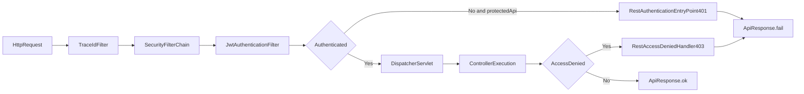

# Security过滤器链总览

## 目标
建立 Spring Security 在本项目中的最小心智模型。

## 代码位置
- `bookshop/src/main/java/com/bookshop/config/security/SecurityConfig.java`
- `bookshop/src/main/java/com/bookshop/config/security/JwtAuthenticationFilter.java`
- `bookshop/src/main/java/com/bookshop/config/security/RestAuthenticationEntryPoint.java`
- `bookshop/src/main/java/com/bookshop/config/security/RestAccessDeniedHandler.java`

## 配置要点
- 禁用：`csrf/httpBasic/formLogin`。
- 会话策略：`STATELESS`（JWT 无状态）。
- 白名单接口：`/health`、登录/刷新/验证码相关接口、`POST /api/users`。
- 其余请求默认 `authenticated()`。

## 过滤器链路图
阅读提示：从左到右看，先认证再授权；未通过的请求会直接走 401/403 失败出口。

## 图解摘要
- 鉴权在进入 Controller 前完成，未通过时直接返回 401/403。
- 已认证请求才会继续进入 DispatcherServlet 和业务层。
- 安全失败出口与业务成功出口都遵循统一 JSON 响应风格。

## 对应源码入口
- `bookshop/src/main/java/com/bookshop/config/security/SecurityConfig.java`
- `bookshop/src/main/java/com/bookshop/config/security/RestAuthenticationEntryPoint.java`

## 异常出口
- 未认证走 `RestAuthenticationEntryPoint`（401）。
- 无权限走 `RestAccessDeniedHandler`（403）。
- 两者统一返回 `ApiResponse` 结构。

## 下一篇
阅读 `30-安全与登录/02-JWT签发校验与续签机制.md`。
