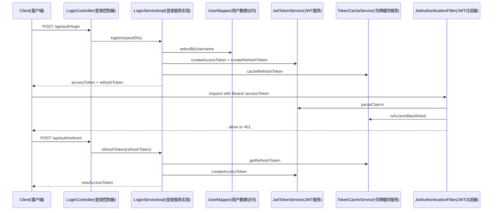

# 登录鉴权时序与失败场景

## 目标
把登录、访问、刷新、登出四条链路串成统一时序。

## 主时序
1. 客户端调用 `/api/auth/login`，`LoginServiceImpl` 校验账号状态与密码。
2. 服务端签发 access + refresh，并缓存 refresh。
3. 客户端访问受保护接口时携带 `Bearer accessToken`。
4. `JwtAuthenticationFilter` 校验 token 类型与黑名单后放行。
5. access 过期后客户端调用 `/api/auth/refresh` 获取新 access。
6. 登出时服务端拉黑当前 access 并删除 refresh 缓存。

## 登录与鉴权时序图
阅读提示：按从上到下时间线阅读，先登录拿令牌，再访问受保护接口，最后走刷新流程。

## 图解摘要
- 首次登录完成账号校验后，会同时发放 access 与 refresh 两类令牌。
- 访问受保护接口时，`JwtAuthenticationFilter` 负责 token 解析与黑名单检查。
- access 过期后，客户端通过 refresh 流程换发新 access，维持会话连续性。

## 对应源码入口
- `java/com/bookshop/controller/login/LoginController.java`
- `java/com/bookshop/service/login/impl/LoginServiceImpl.java`

## 失败场景
- 用户名/密码错误：`AUTH_INVALID_CREDENTIALS`
- 账号禁用：`AUTH_FORBIDDEN`
- refresh 失效或不匹配：`AUTH_TOKEN_INVALID`
- 缺 token 或非法 token：401（Security 入口处理器）

## 下一篇
阅读 [01-Book模块分层解析](../40-业务模块拆解/01-Book模块分层解析.md)。
