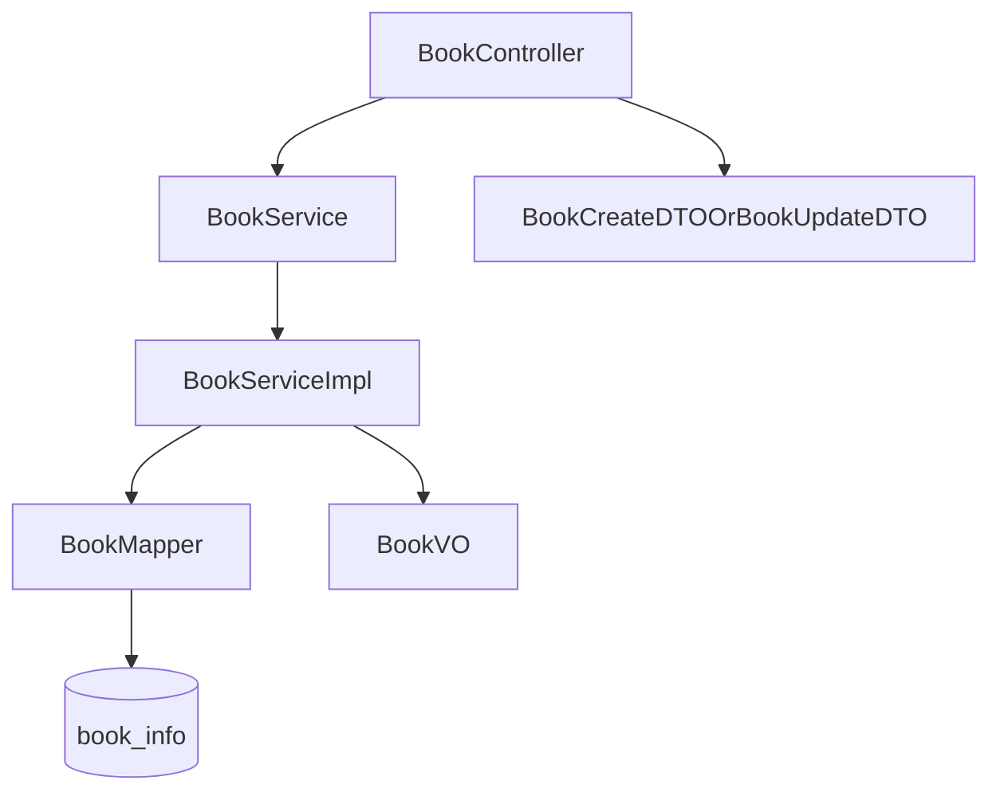

# Book模块分层解析

## 目标
用图书模块建立分层设计的参考样例。

## 代码位置
- Controller：`bookshop/src/main/java/com/bookshop/controller/book/BookController.java`
- Service：`bookshop/src/main/java/com/bookshop/service/book/BookService.java`
- ServiceImpl：`bookshop/src/main/java/com/bookshop/service/book/impl/BookServiceImpl.java`
- Mapper：`bookshop/src/main/java/com/bookshop/mapper/book/BookMapper.java`
- DTO/VO：`bookshop/src/main/java/com/bookshop/dto/book`、`bookshop/src/main/java/com/bookshop/vo/book`

## 分层职责
- Controller：接收请求、参数校验、返回 `ApiResponse`。
- Service：封装增删改查业务规则与异常判断。
- Mapper：执行具体 SQL。

## 结构图
阅读提示：从上到下看分层依赖，Controller 仅入参/出参，Service 承接业务，Mapper 落库。

## 图解摘要
- Book 模块严格按 Controller、Service、Mapper 分层，职责边界清晰。
- DTO/VO 与数据库表解耦，避免实体直接暴露给接口层。
- 业务扩展建议放在 Service 层，不破坏 Controller 与 Mapper 简洁性。

## 对应源码入口
- `bookshop/src/main/java/com/bookshop/controller/book/BookController.java`
- `bookshop/src/main/java/com/bookshop/service/book/impl/BookServiceImpl.java`

## 常见扩展位
- 上下架状态、库存策略、分页检索、排序字段白名单。

## 下一篇
阅读 `40-业务模块拆解/02-User模块分层解析.md`。
