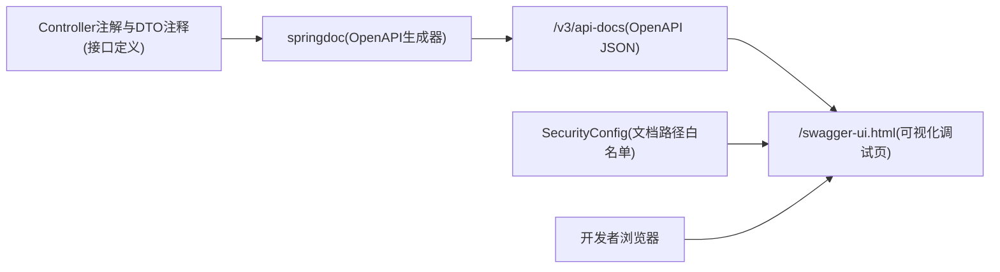

# Swagger3与OpenAPI落地

## 目标
基于项目真实代码，说明 Swagger3/OpenAPI 当前接入方式、访问 URL、安全协作和使用边界。

## 代码位置
- OpenAPI 配置：`config/swagger/OpenApiConfig.java`
- 安全白名单：`config/security/SecurityConfig.java`
- 主配置：`resources/application.yml`
- 依赖声明：`pom.xml`

## 已落地能力
- 已接入 `springdoc-openapi-starter-webmvc-ui`。
- OpenAPI 文档分组：`auth`、`user`、`book`。
- Bearer 认证方案已在文档中声明，可用于受保护接口调试。
- 安全白名单已放行：
  - `/v3/api-docs/**`
  - `/swagger-ui/**`
  - `/swagger-ui.html`

## 常用 URL
- OpenAPI JSON：`http://127.0.0.1:8080/v3/api-docs`
- Swagger UI：`http://127.0.0.1:8080/swagger-ui.html`

## 协作关系图
阅读提示：先由 springdoc 生成文档，再由 Swagger UI 展示；鉴权接口通过 Security 白名单放行文档页访问。

## 下一篇
阅读 [02-工程结构与依赖现状](./02-工程结构与依赖现状.md)。
