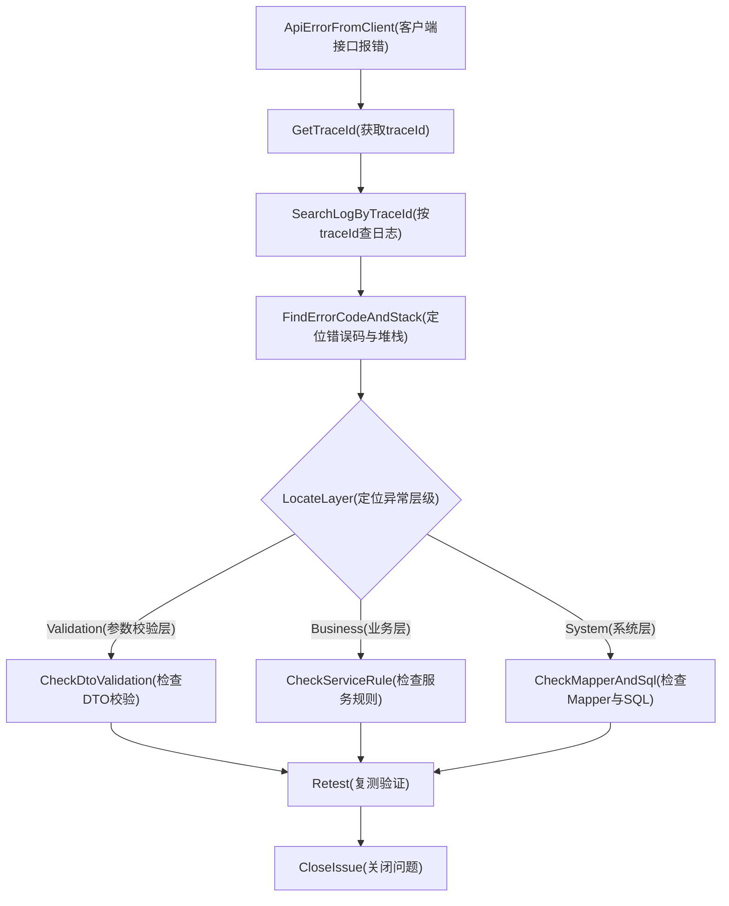

# Trace 请求日志追踪体系
## 简介
这四个概念构成了一套完整的**请求日志追踪体系**
	TraceIdFilter ，TraceId ，MDC ，request attribute

## Traceid: 链路追踪id
**一句话定义**：一次 HTTP 请求的**唯一身份证号**。

当用户的请求进入系统时，`TraceIdFilter` 会生成一个全局唯一的字符串（通常用 `UUID` 或雪花算法），并把它挂在这个请求的“身上”。此后，**本次请求经过的所有类、所有方法、所有 SQL**，在打印日志时都会带上这个 ID。

**它要解决什么问题？**

- 线上环境每秒可能有成百上千个请求，日志文件里信息是交错混杂的。
    
- 如果没有 `traceId`，你根本分不清哪一行 `select * from user` 是**张三**的请求触发的，哪一行是**李四**的。
    
- 有了 `traceId`，`grep "trace-123" app.log` 就能**把这一次请求从进来到出去的完整脚印全部串起来**。

## TraceIdFilter（链路追踪过滤器）

**一句话定义**：它是在 Tomcat 和 Spring MVC 之间**第一个**拦截请求的“门卫”，负责给请求**发放** `traceId`。

结合你笔记里的流程图，它的位置是：
	Tomcat 收到请求  →  [TraceIdFilter]  →  SecurityFilterChain ...

## MDC（Mapped Diagnostic Context）

**一句话定义**：这是日志框架（Logback/Log4j2）提供的一个 **ThreadLocal 增强版容器**。

- **`MDC` 解决什么问题？**
    
    - 你在业务代码的 `log.info("用户登录")` 里，一般不会手动写死 `traceId`。
        
    - 但只要你在日志配置 `logback-spring.xml` 里配置了 `%X{traceId}`，**日志框架就会自动从 MDC 里把这个值取出来拼到每一行日志前面**。


## Request Attribute

**一句话定义**：这是请求对象 `HttpServletRequest` 自带的**随身储物柜**，只在**当前这一次请求**的生命周期内有效。

**它和 MDC 有什么区别？**

|维度|MDC|Request Attribute|
|---|---|---|
|**存储位置**|线程局部变量（`ThreadLocal`）|`HttpServletRequest` 对象内部 Map|
|**主要使用者**|日志框架（Logback）|Java 代码（业务逻辑）|
|**典型场景**|打印日志时自动拼接|代码里想拿 `traceId` 塞给下游微服务|

**代码示例**：  
你笔记里的 `TraceIdFilter` 把 `traceId` 存了一份到 `request.setAttribute`，目的是为了方便业务代码在**不依赖 MDC 静态方法**的情况下，通过 `request.getAttribute("traceId")` 获取它。


## 笔记里 `X-Trace-Id` 响应头的作用

`response.setHeader("X-Trace-Id", traceId);`

- **用途**：当**前端页面报错**或者**App 白屏**时，用户截屏发给你。
    
- **流程**：你让用户打开浏览器 F12 -> Network -> 找到那个报红的接口 -> 查看 **Response Headers** -> 找到 `X-Trace-Id`。
    
- **结果**：你拿着这个 ID 去服务器 `grep`，一秒定位报错日志，**不用听用户描述**。


## 总结一张图


```
[请求进入]
    │
    ▼
TraceIdFilter 生成 ID: "abc-123"
    │
    ├──► MDC.put("traceId")      →  Logback 自动打印: [abc-123]
    ├──► request.setAttribute()  →  业务代码可取用
    └──► response.setHeader()    →  前端能看到
    │
    ▼
[业务逻辑 & 日志输出]
    │
    ▼
TraceIdFilter finally 清理 MDC
```


# TraceId排障实战路径

## 目标
形成从“接口报错”到“定位根因”的固定动作链。

## 实战步骤
1. 从响应体或响应头拿到 `traceId`。
2. 在日志文件 `bookshop/logs/bookshop-dev.log` 搜索该 `traceId`。
3. 找到同一请求下的 warn/error 记录。
4. 对照错误码回到对应 Service/Mapper 与 SQL。
5. 修复后复测并验证日志恢复正常。

## 排障流程图
阅读提示：先拿 `traceId` 再查日志，按异常层次定位到 DTO、Service 或 Mapper/SQL。

## 图解摘要
- 排障入口统一是 `traceId`，先定位日志再判断问题层次。
- 根据异常类型快速分流到 DTO、Service 或 Mapper/SQL 检查。
- 修复后必须回到复测节点确认问题闭环。

## 对应源码入口
- `com/bookshop/common/trace/TraceIdFilter.java`
- `com/bookshop/exception/GlobalExceptionHandler.java`

## 常见组合
- `VALIDATION_400` + 字段错误：多为 DTO 注解或前端字段名问题。
- `AUTH_TOKEN_INVALID` + 401：多为 token 过期、类型不匹配、缓存失效。
- `SYSTEM_500`：优先看完整堆栈首个业务触发点。

## 下一篇
阅读 [04-APM接入预案](./04-APM接入预案.md)。
