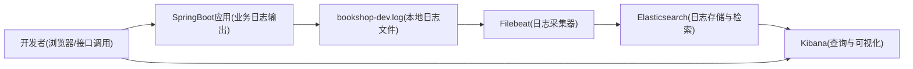

# ELK本地协作与使用说明

## 目标
基于当前项目真实配置，说明 ELK 在本地是如何与 Spring Boot 协作的、怎么用、看哪些 URL、如何排障。

## ELK 含义（结合本项目）
- `E` = Elasticsearch：日志存储与检索引擎（本地端口 `9200`）。
- `L` = Logstash：通用日志管道工具（本项目当前未启用）。
- `K` = Kibana：日志查询与可视化界面（本地端口 `5601`）。
- 本项目实际链路是 `SpringBoot -> 文件日志 -> Filebeat -> Elasticsearch -> Kibana`，即常见的“ELK 使用形态（含 Beat）”。

## 项目内协作关系（真实落地点）
- Spring Boot 日志输出：
  - `resources/logback-spring.xml` 已配置本地文件输出 `logs/bookshop-dev.log`。
  - 日志 pattern 已包含 `traceId=%X{traceId:-}`，可用于链路排障。
- Filebeat 角色：
  - 负责采集 `bookshop/logs/*.log` 并发送到 Elasticsearch。
  - 本地运维文档中已给出测试命令与启动命令。
- Elasticsearch 角色：
  - 接收并存储日志索引（含 `bookshop-logs*` 或 `.ds-bookshop-logs-*` 数据流索引）。
- Kibana 角色：
  - 在 Discover 中通过 Data View 检索日志，按 `traceId/path/level` 排障。

## 本地常用 URL
- Elasticsearch 健康检查：`http://127.0.0.1:9200`
- Kibana 状态检查：`http://127.0.0.1:5601/api/status`
- Kibana 界面入口：`http://127.0.0.1:5601`
- Spring Boot 健康接口：`http://127.0.0.1:8080/health`

## 协作结构图
阅读提示：从左到右看，应用先写本地日志，Filebeat 采集后送 ES，最终在 Kibana 查询展示。

## 最小使用示例（本地）
1. 按运维手册顺序启动：Redis -> ES -> Kibana -> SpringBoot -> Filebeat。
2. 调用任意接口（如 `/health`）产生日志。
3. 打开 Kibana Discover，Data View 选择 `bookshop-logs*`。
4. 时间范围切到“过去 15 分钟”，按 `traceId` 或 `path` 过滤查看。

## 常见问题示例
- Kibana 有界面但没日志：
  - 先检查 Filebeat 是否在运行、Data View 是否正确、时间范围是否过窄。
- 只看到空索引：
  - 注意是否写入了数据流索引 `.ds-bookshop-logs-*`，不要只盯普通索引名。
- 认证接口 500：
  - 本项目曾出现过 Redis 未启动导致认证链路异常，先查 Redis 状态。

## 下一篇
阅读 [04-APM接入预案](./04-APM接入预案.md) 对比“日志检索”和“调用链追踪”的分工。
