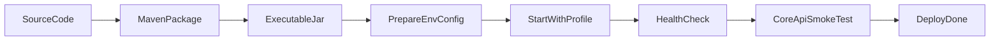

# 部署最小流程

## 目标
定义从构建到可运行服务的最小可行流程。

## 最小流程
1. 使用 Maven 打包可执行 Jar。
2. 准备目标环境配置（数据库、Redis、JWT 密钥）。
3. 以目标 profile 启动应用。
4. 通过 `/health` 和核心接口做冒烟验证。

## 部署流程图
阅读提示：从左到右按发布流水线阅读，打包产物经过环境准备后进入健康检查与冒烟验证。

## 图解摘要
- 部署主线是“构建产物 -> 环境准备 -> 启动应用 -> 冒烟验证”。
- 冒烟检查必须覆盖健康接口与至少一条核心业务链路。
- 只有验证通过，部署才算真正完成。

## 对应源码入口
- `bookshop/src/main/resources/application.yml`
- `bookshop/src/main/java/com/bookshop/controller/system/HealthController.java`

## 依赖前置
- MySQL 可用且已执行必要 SQL 脚本。
- Redis 可用，用于 token 缓存与黑名单。

## 下一篇
阅读 `90-部署与运维/03-发布前检查清单.md`。
